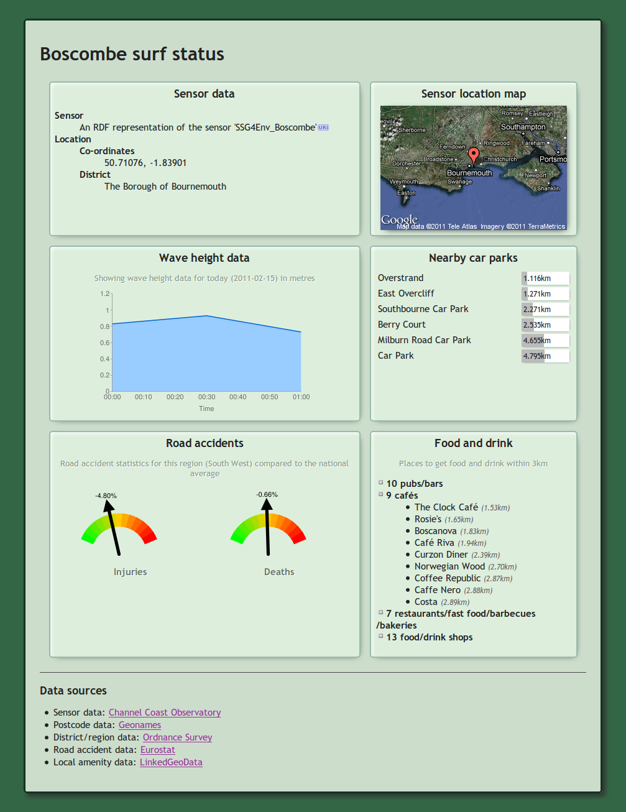
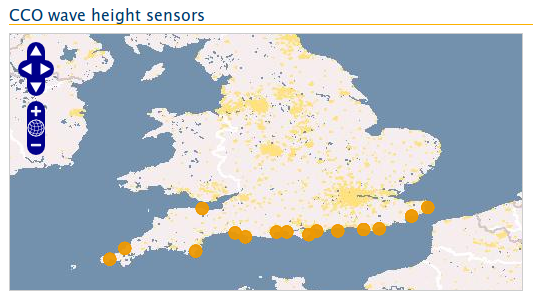

Coding a mashup: surf status
============================

As an example of using the HLAPI this section describes how a "surf status" 
mashup application was built.

The purpose of this mashup is to take wave height data from the HLAPI for a 
given area, plot this data on a graph and at the same time pick up related 
information from other sources such as a map showing the location and lists of 
nearby amenities.

Scripting language and libraries
--------------------------------

This example uses the [PHP][php] scripting language. For Sparql queries and RDF 
manipulation it uses the [Arc2][arc2] library and, for ease of coding and 
readability, [Graphite][graphite]. The [Flot][flot] Javascript library (a 
[Jquery][jquery] plugin) is used for charts.

Another useful tool is an RDF browser such as the [Q&D RDF Browser][qdbrowser].

[php]: http://php.net/
[arc2]: http://arc.semsol.org/
[graphite]: http://graphite.ecs.soton.ac.uk/
[flot]: http://code.google.com/p/flot/
[jquery]: http://jquery.com/
[qdbrowser]: http://graphite.ecs.soton.ac.uk/browser/

Setting up the graph
--------------------

First we define some namespaces, load in the Arc2 and Graphite libraries and set 
up a new Graphite graph and tell it to use our namespaces.

	$ns = array(
		"id-semsorgrid" => "http://id.semsorgrid.ecs.soton.ac.uk/",
		"ssn" => "http://purl.oclc.org/NET/ssnx/ssn#",
		"ssne" => "http://www.semsorgrid4env.eu/ontologies/SsnExtension.owl#",
		"DUL" => "http://www.loa-cnr.it/ontologies/DUL.owl#",
		"time" => "http://www.w3.org/2006/time#",
		// ...more namespaces
	);
	require_once "arc/ARC2.php";
	require_once "Graphite/graphite/Graphite.php";
	$graph = new Graphite($ns);

It's also useful to tell Graphite to cache the RDF files it downloads:

	$cachedir = "/tmp/mashupcache/graphite";
	if (!is_dir($cachedir))
		mkdir($cachedir, 0777, true)
	$graph->cacheDir($cachedir);

Getting the latest wave height readings
---------------------------------------

For this mashup we want to be able to start from any sensor URI and fetch its 
latest wave height data.

We're allowing any URI to be used as a starting point, passed in as an HTTP GET 
parameter. If none is passed we default to the Boscombe sensor. Then we load 
whatever document the URI gives us into our graph.

	$startURI = "http://id.semsorgrid.ecs.soton.ac.uk/sensors/cco/boscombe";
	if (isset($_GET["uri"]))
		$startURI = $_GET["uri"];

	// load document into graph
	if ($graph->load($startURI) == 0)
		die("failed to load any triples from '$startURI'");

In order to maximize code reuse, we want at this point to accept the URI of 
either a sensor or a collection of observations. We can test whether or not we 
have a sensor with a conditional like the following:

	$resource = $graph->resource($startURI);
	if ($resource->isType("ssn:SensingDevice")) {
		...

If we have a sensor, the way to get to the latest observations is to look first 
at the links to summaries that sensor holds.

	$summaries = $graph->allOfType("ssne:PropertySummary");
	if (count($summaries) == 0)
		die("can't get to observations from sensor unless it has summaries");

We can then filter the property summaries to just those which regard wave 
height, and load them:

	$waveheightsummaries = array();
	foreach ($summaries as $summary) {
		if ($summary->get("ssne:forMeasuredProperty") == "http://marinemetadata.org/2005/08/ndbc_waves#Wind_Wave_Height") {
			$summary->load();
			$waveheightsummaries[] = $summary;
		}
	}

The property summaries link to the last observation in whatever collection they 
are summarizing. We need to loop through the property summaries to find the 
latest one of these. We'll use a helper function `observationdate` to return the 
timestamp, given the `ssn:Observation` resource.

	// latest lastobservation
	$lastobservation = null;
	foreach ($waveheightsummaries as $summary) {
		$observation = $summary->get("ssne:hasLastObservation");
		if ($observation->isNull())
			continue;
		if (is_null($lastobservation) || observationdate($observation) > observationdate($lastobservation))
			$lastobservation = $observation;
	}

This uses a helper function, `observationdate`, which returns the timestamp of 
an observation given its `ssn:Observation` resource:

	// get an observation's timestamp
	function observationdate($o) {
		$time = $o->get("ssn:observationResultTime");
		if ($time->isNull() || !$time->isType("time:Interval"))
			die("observation '$o' has no suitable observation date");
		return strtotime($time->get("time:hasBeginning"));
	}

So that we can display some interesting things about the top-level collection 
this latest observation was found in, let's store that resource in a variable.

	// get collection that observation's summary is summarizing
	$toplevelcollection = $lastobservation->get("-ssne:hasLastObservation")->get("-ssne:hasPropertySummary");

We can then load the last observation's document into the graph. This will have 
the effect of also loading whatever other observations are in the same canonical 
collection of observations. This is generally all observations of the same type 
made by the same sensor in the same time period (such as a single day). We can 
use the reverse relation feature of Graphite to find whichever element links 
*to* the latest observation with the `DUL:hasMember`, thus finding its canonical 
collection.

	// get collection that observation's summary is summarizing
	$toplevelcollection = $lastobservation->get("-ssne:hasLastObservation")->get("-ssne:hasPropertySummary");

	// load the last observation
	$lastobservation->load();

	// get the collection it's part of
	$collection = $lastobservation->get("-DUL:hasMember");

That's all we need to do if the URI passed in was a sensor. If it was anything 
else (in the `else` clause of our conditional above) we just need to ensure we 
have been passed a collection.

	// ensure we have exactly one collection
	$collection = $graph->allOfType("ssne:ObservationCollection");
	$toplevelcollection = $collection;
	if (count($collection) != 1)
		die("expected exactly 1 collection");
	$collection = $collection->current();

Note that despite the singular variant of the word "collection", this variable 
initially holds an object of type Graphite_ResourceList. In the last line of the 
above snippet this is replaced with the "current" item in that list, so giving 
the single collection.

Finally, we can get the summary of wave height readings if one is available for 
this collection. We'll also get the mean from that summary so it can later be 
drawn as a line on the graph of observations.

	// get summary
	$summary = null;
	foreach ($toplevelcollection->all("ssne:hasPropertySummary") as $s) {
		if ($s->get("ssne:forMeasuredProperty") == PROP_WINDWAVEHEIGHT) {
			$summary = $s;
			$summary->load();
			$mean = floatVal((string) $summary->get("ssne:hasMeasuredMeanValue")->get("ssne:hasQuantityValue"));
			break;
		}
	}

Collecting the observations
---------------------------

It's easy to get all the `ssn:Observation` resources from our collection and 
sort them using a helper function:

	// collect observations
	$observations = $collection->all("DUL:hasMember")->allOfType("ssn:Observation")->getArrayCopy();
	usort($observations, "sortbydate");

	// sort an array of observations by time
	function sortbydate($a, $b) {
		return observationdate($a) - observationdate($b);
	}

	if (empty($observations))
		die("no observations");

We can then get the URIs of the "previous" and "next" links the HLAPI provides. 
Using these we'll be able to load earlier and later data into the graph using 
Ajax requests.

	// get URIs of previous and next observations for pagination
	$prevobservation = $observations[0]->get("DUL:directlyFollows");
	if ($prevobservation->isNull())
		$prevobservation = null;
	$nextobservation = $observations[count($observations) - 1]->get("DUL:directlyPrecedes");
	if ($nextobservation->isNull())
		$nextobservation = null;

Now we need to get the observations in a structure the Flot library can turn 
into a graph. So to get an array of times and heights we can do something like 
the following:

	$timesandheights = array();
	foreach ($observations as $observation)
		$timesandheights[] = array(observationdate($observation), floatVal((string) $observation->get("ssn:observationResult")->get("ssn:hasValue")->get("ssne:hasQuantityValue")));

Responding to an Ajax request
-----------------------------

At this point we have all we need to send back chunks of data for graphing to 
the browser, in the case that the user has clicked a "next" or "previous" link. 
We'll detect a GET variable and if it's received, just send back the graph data 
in the JSON format. Note that Flot likes its timestamps to be in milliseconds so 
we define a helper function to multiply them all by 1000.

	if (isset($_GET["chart"])) {
		header("Content-Type: application/json");
		echo json_encode(array(
			"data" => timestamptomilliseconds($timesandheights),
			"source" => $collection->uri,
			"prev" => is_null($prevobservation) ? null : $prevobservation->uri,
			"next" => is_null($nextobservation) ? null : $nextobservation->uri,
		));
		exit;
	}

	// multiply the timestamps by 1000 to return them in milliseconds, for Flot
	function timestamptomilliseconds($readings) {
		$a = array();
		foreach ($readings as $reading)
			$a[] = array($reading[0] * 1000, $reading[1]);
		return $a;
	}

The corresponding Javascript code (to send the requset and then update the graph 
when the response arrives) is shown below.

Getting the sensor's URI and coordinates
----------------------------------------

The sensor's URI is easy to get, since we can just get the `ssn:observedBy` 
relation of any observation in our collection.

	// get sensor
	$sensor = $observations[0]->get("ssn:observedBy");

A Graphite resource object's `__toString` method returns the resource's URI, so 
wherever we want to use the URI we can just use our `$sensor` variable, whether 
implicitly or explicitly cast to a string.

In order to get the sensor's coordinates we have to do a little more work.

	// get sensor coordinates
	if ($sensor->load() == 0)
		die("couldn't load sensor RDF");
	$location = $sensor->get("ssn:hasDeployment")->get("ssn:deployedOnPlatform")->get("sw:hasLocation");
	if ($location->isNull())
		die("couldn't get sensor coordinates");
	$coords = array(
		floatVal((string) $location->get("sw:coordinate2")->get("sw:hasNumericValue")),
		floatVal((string) $location->get("sw:coordinate1")->get("sw:hasNumericValue")),
	);

Finding other sensors
---------------------

To provide a list of other sensors which measure wave height we can query the 
HLAPI's Sparql endpoint.

	$store = ARC2::getRemoteStore(array("remote_store_endpoint" => "http://semsorgrid.ecs.soton.ac.uk:8000/sparql/"));
	$rows = $store->query("
		PREFIX ssn: <>
		PREFIX rdfs: <>
		SELECT ?sensor ?sensorname
		WHERE {
			?obs
				a ssn:Observation ;
				ssn:observedProperty <http://marinemetadata.org/2005/08/ndbc_waves#Wind_Wave_Height> ;
				ssn:observedBy ?sensor ;
			.
			OPTIONAL {
				?sensor rdfs:label ?sensorname .
			}
			FILTER (?sensor != <$sensor>)
	", "rows");

The resulting data structure can then be looped through to show a list. In this 
mashup we're linking the sensor names to run the mashup again with the other 
sensor's URI as the argument, to see the surf status in different areas.

Getting linked data on nearby amenities from Linked Geodata
----------------------------------------------------------

We will use Linked Geodata's Sparql endpoint to get information on amenities 
close to the wave height sensor. By browsing Linked Geodata we can build a list 
of suitable amenity types, and then put together and send a query:

	$store = ARC2::getRemoteStore(array("remote_store_endpoint" => "http://linkedgeodata.org/sparql/"));
	$rows = $store->query("
		PREFIX lgdo: <http://linkedgeodata.org/ontology/>
		PREFIX geo: <http://www.w3.org/2003/01/geo/wgs84_pos#>
		PREFIX rdfs: <http://www.w3.org/2000/01/rdf-schema#>
		SELECT * WHERE {
			{ ?place a lgdo:CoffeeShop . }
			UNION { ?place a lgdo:Cafe . }
			UNION { ?place a lgdo:InternetCafe . }
			?place
				a ?type ;
				geo:geometry ?placegeo ;
				rdfs:label ?placename .
			FILTER(<bif:st_intersects> (?placegeo, <bif:st_point> ($coords[1], $coords[0]), 5)) .
		}
	", "rows");

The returned results include the coordinates of each matching amenity 
(`placegeo`), from which the distance to our area of interest can be calculated.

Visualizing the data
--------------------

Explaining the snippet below is out of the scope of this document, but it uses 
Flot to produce a line graph of wave height against time. If the `$mean` 
variable was set above (if we had a suitable summary), a line is drawn at that 
point.

	

	<a id="chart_prev" href="#">&larr; Show earlier data</a>
	<a id="chart_next" href="#">Show later data &rarr;</a>
	

Some Javascript is then needed to send Ajax requests for next and previous data 
back to the server, and then to update the graph with the data in the response.

Exactly how this works is not in the scope of this document -- see the Jquery 
and Flot documentation for details.

	

Finished mashup
---------------

The finished mashup, once styled, and a few more data sources added, looks 
something like the screenshot shown.

Displaying a map of all wave height sensors
-------------------------------------------

This isn't actually used in our surf status mashup but it's fairly trivial to 
display a map of all the sensors with [Openlayers][openlayers].

[openlayers]: http://openlayers.org/

One of the observation serializations available from the CCO deployment of the 
HLAPI is a GeoJSON format. This serialization, which shows the locations of all 
wave height readings made in a particular time frame, can be rendered by various 
mapping engines including Openlayers.

The markup to display the map, given the path to an OpenJSON file, is very 
simple and fully documented by Openlayers.

Depending on how the HLAPI is configured the OpenJSON representation of wave 
height readings for a particular hour may be at

	http://geojson.semsorgrid.ecs.soton.ac.uk/observations/cco/Hs/20110215/00

Given this URL a map such as the following may be generated.

